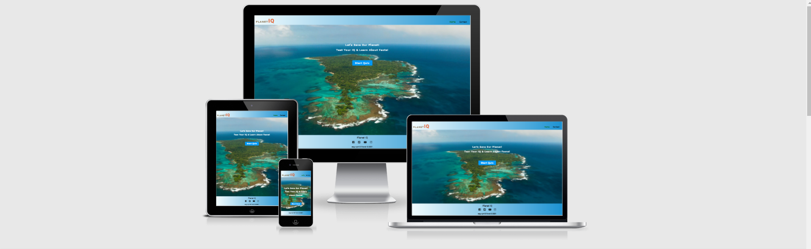

# Planet IQ Quiz App 

## Interactive Frontend Development Milestone-2 Project

Intention behind to build this Project is educational purpose! In this project I have used HTML for structure , 
CSS for the style to make the app attractive ,Java script for functionality to make the project more user intractive, emailjs to get user feedback about app,and finally 
media query & bootstap to make the project responsive on all devices.

This project presents a Quiz App call Planet IQ. Its not just a Quiz App. Each question contains vital facts which will help user to get more knowledge about our Planet.  

App has a two diffrent webpages each page has diffrent contents and buttons but as user prospective each webpage will easily and smoothly will navigate user to their destination.
Each question has four options, User has one chance to choose the right option and user can't click more the one option, once user click the option if it is right option will turn 
green and if user answer is wrong it will turn in to red and right answer will pop up automatically(green color). At the end of the Quiz user will be able to see the final score card. 
 
 ##  Screenshots of project

 # Desktop, Ipad & Mobile

 

 # Highlights

 * [User Experience (UX)](#User-experience-UX)

    * [User Desire](#user-desire)
     
    * [User Stories](#user-stories)

    * [Wireframes of website](#wireframes-of-website)

    * [Surface](#surface)

    * [Features](#features)

    * [Technology used in a Project](#technology-used-in-a-Project)

    * [ Functionality Test ](#functionality-test)

        * [Code Validation Test](#Code-validation-test)

        * [ Performance Testing ](#performance-testing)

    * [Deployment](#Deployment)

    * [Credits](#credits)

    * [Screenshots of complete project](#screenshorts-of-complete-project)

#  User Experience (UX)

## User Desire

   * User will find easily destination by just click on the start quiz button on home page which will lead user to the quiz app.

   * User will be easy intractive with the quiz app beacuse theme of the app is to gain the knowledge of user.

   * User is able to  send their response to author of the quiz app via contact form.

## User Stories
     
   *  User should also to able to see how many question they have answer.

   *  User should be select one option each question if the answer is correct it turn green otherwise red.

   *  The Home screen should have a button that users can click to start the quiz.

   *  User should be  able to see the score card end of the quiz.

   *  User should be able to quit the quiz any time.

   *  Once the quiz has finished , User should be able to start a new quiz. 

   *  User should be able to send response to the author of the Quiz app.

   
     

       

