# Planet IQ Quiz App 

## Interactive Frontend Development Milestone-2 Project

Intention behind to build this Project is educational purpose! In this project I have used HTML for structure , 
CSS for the style to make the app attractive ,Java script for functionality to make the project more user intractive, emailjs to get user feedback about app,and finally 
media query & bootstap to make the project responsive on all devices.

This project presents a Quiz App call Planet IQ. Its not just a Quiz App. Each question contains vital facts which will help user to get more knowledge about our Planet.  

App has a two diffrent webpages each page has diffrent contents and buttons but as user prospective each webpage will easily and smoothly will navigate user to their destination.
Each question has four options, User has one chance to choose the right option and user can't click more the one option, once user click the option if it is right option will turn 
green and if user answer is wrong it will turn in to red and right answer will pop up automatically(green color). At the end of the Quiz user will be able to see the final score card. 
 
 ##  Screenshots of project

 # Desktop, Ipad & Mobile

 

 # Highlights

 * [User Experience (UX)](#User-experience-UX)

    * [User Desire](#user-desire)
     
    * [User Stories](#user-stories)

    * [Wireframes of website](#wireframes-of-website)

    * [Surface](#surface)

    * [Features](#features)

    * [Technology used in a Project](#technology-used-in-a-Project)

    * [Testing](#testing)

        * [ Functionality Test ](#functionality-test)
        
        * [ Compatibility testing ](#Compatibility-testing) 

        * [Code Validation Test](#Code-validation-test)

        * [Error found during site development ](#Error-found-during-site-development)

        * [ Performance Testing ](#performance-testing)

    * [Deployment](#Deployment)

    * [Credits](#credits)

    * [Screenshots of complete project](#screenshorts-of-complete-project)

#  User Experience (UX)

## User Desire

   * User will find easily destination by just click on the start quiz button on home page which will lead user to the quiz app.

   * User will be easy intractive with the quiz app beacuse theme of the app is to gain the knowledge of user.

   * User is able to  send their response to author of the quiz app via contact form.

 [Back to Highlights ](#highlights)

## User Stories
     
   *  User should also to able to see how many question they have answer.

   *  User should be select one option each question if the answer is correct it turn green otherwise red.

   *  The Home screen should have a button that users can click to start the quiz.

   *  User should be  able to see the score card end of the quiz.

   *  User should be able to quit the quiz any time.

   *  Once the quiz has finished , User should be able to start a new quiz. 

   *  User should be able to send response to the author of the Quiz app.

# Wireframes of Website  

   ### I used a balsamiq to create a wireframe. Here is link [balsamiq](https://www.balsamiq.com/)

   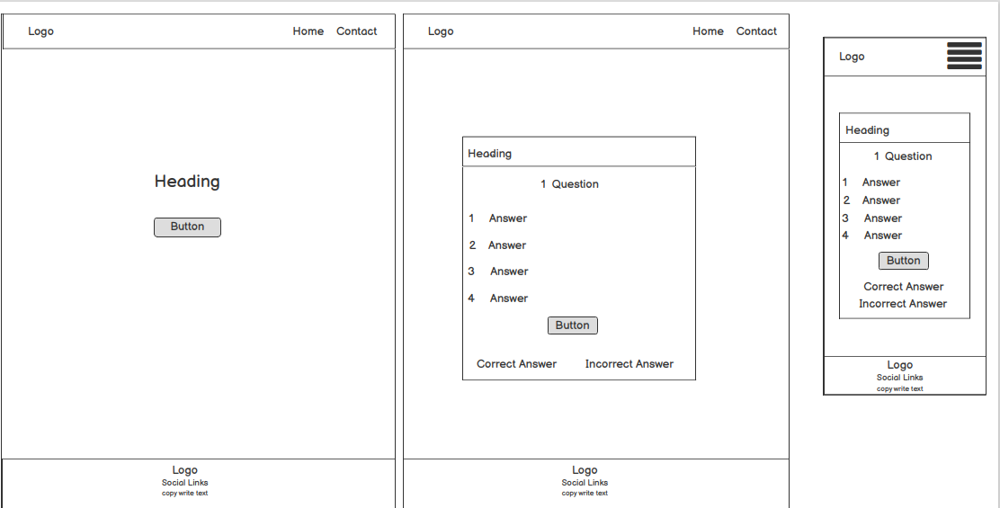  

   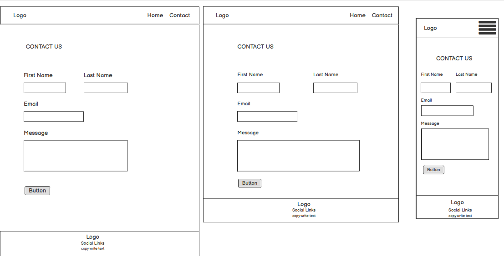  

[Back to Highlights ](#highlights)

# Surface

## Colors 

Color used in a project

 * Font Color
     
      *  White

      *  orangered

      *  black 

      * rgb(122, 98, 61)

  * background-color

      *  #1c92d2

      *  #c2e59c 

      *  #2c3e50

      *  rgb(153, 56, 71)

## Fonts used in project 

   * font-family

     * font-family: 'Roboto', sans-serif;

## Images 

   *  Images upload from google images [google-images](https://www.google.se/search?q=google+planet+nature&tbm=isch&ved=2ahUKEwjtmtPS0a7xAhWRyyoKHTSIAQcQ2-cCegQIABAA&oq=google+planet+nature&gs_lcp=CgNpbWcQAzoECCMQJzoCCAA6BggAEAUQHjoGCAAQCBAeOgQIABAeUPA9WKfDAWDC0AFoC3AAeACAAVCIAd0HkgECMTSYAQCgAQGqAQtnd3Mtd2l6LWltZ8ABAQ&sclient=img&ei=W5_TYK2BCpGXqwG0kIY4&bih=937&biw=1920)
 
[Back to Highlights ](#highlights)

# Features
 
    Quiz app consists of 2 pages Home page which contains start button which leads user to quiz app and second page contains Contact Form where user is able to
    leave their feeback to the author. 

   *  Inside the quiz box each question has four options and two buttons one is quit button and otherone is next buttton which will bring user to next question.

   *  End of the quiz final Result box will be visible beneath results there is play again button which will bring  user back to quiz box.

 ## Footer

   *   Footer contains social links and App name.

## Future development

   * Future development will be to add a timer so user has to answer with in minimum time of 20sec. That will make user to more intractive and excited to play quiz. 

   * My next move will be to increase the quantity of question so user can enjoy more.

   * last one will be to create one extra page (with add some more functionality) the page will contain all the vital facts about our planet which will help user to play the quiz.

   [Back to Highlights ](#highlights)

# Technology used in a Project

 ## HTML 

   * To create whole structure of project.

 ## CSS  

 * TO style the whole structure of project.

 ## JavaScript

 *  I have used Javascript for converting the static web page into more user interactive. 

## Bootstrap & Media Query

  * To make it responsive on all the devices such as Desktop , Ipad  and Mobile.

## Emailjs 

   * EmailJS is a allows for the sending of emails directly from JavaScript without the need for any backend code. Here is link [emailjs](https://www.emailjs.com/)

 ## SweetAlert 

  *  Its a library of beautiful sweetAlerts which helps to make webpage more user interactive. I am using sweetAlerts in contact page once user  
     message submit successfully it will pop up and tell user your message has been delivered. 
     
## Wireframes

  * Use balsamiq as a wireframe tool.

 ## Google Font 

   *  To make structure beautiful.

## Github 

   * To keep project safe and publically on cloud.

## Gitpod 

   * Used as code editor to create my project.  

[Back to Highlights ](#highlights)  

# Testing 

## Functionality Testing 
   
   * I used  Chrome developer tools throughout the project for testing and solving problems with responsiveness and style issues.

##  Compatibility Testing 

  *   Project has been tested on different devices such as Desktop, Ipad and on diffrent Mobiles Iphone x, Iphone 6,7,8 , Samsung Note 20 ,Iphone 5 ,Iphone4,
      Nexus and it works great.Webpage is fully responsive on all devices.

## Code Validation Test

I have checked up the validity of both the Html webpages and CSS file:

  * [The W3C Markup Validation Service](https://validator.w3.org)   
  
  * [The W3C CSS Validation Service ](https://jigsaw.w3.org)

## Error found during site development  

  * During the site development I found the error in index.html ( webpage moves left to right) even I used margin 0 padding 0 in external css to
    removes all default margin and padding for every object on the page but it did not helped.

    * Then I  start google it to find out how to resolve this error, what I didnt get anything what i need.

    *  I decided to test internal css To fix this error, I used internal css body,html { margin= 0, padding = 0, width:100% ,height: 100%, overflow-x:hidden}. 
       After when I inculde this line of code error was resolved. 

* Mobile responsive error  

   * I found error some of devices was not responsive(such as Iphone 5,4  all the devices below then 320 px). 

   * To solve this issue I add extra media query with max-width 320px.
   
   * After adding media query , What I found content start overflow from  quiz box  to solve this error I add overflow scrolbar.

# Performance Testing 

   I have used lighthouse tool to check the performance of website. Here is link [Lighthouse](https://developers.google.com)

   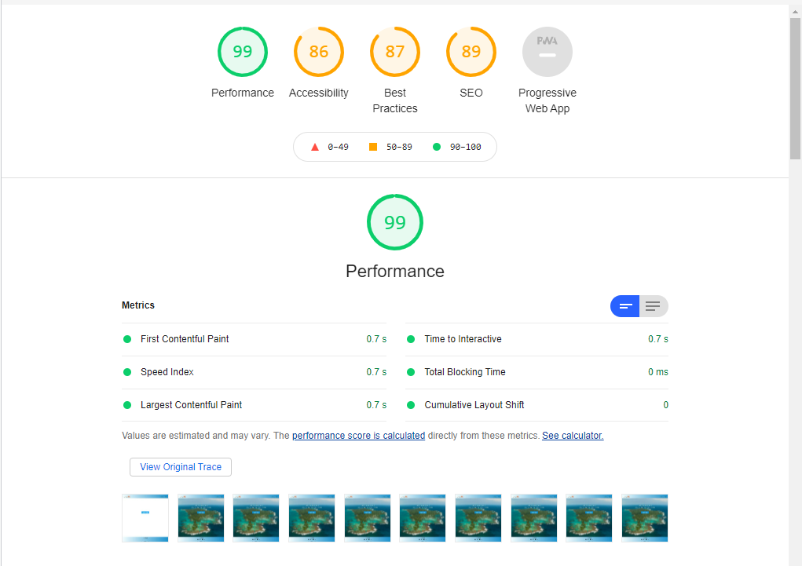

   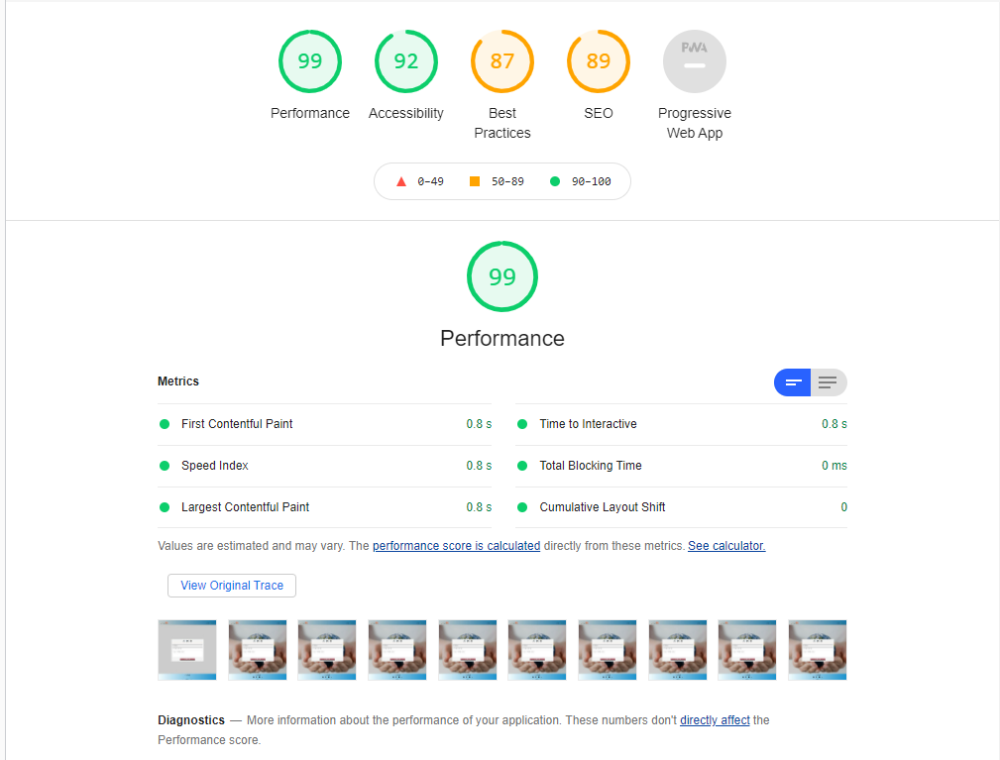

   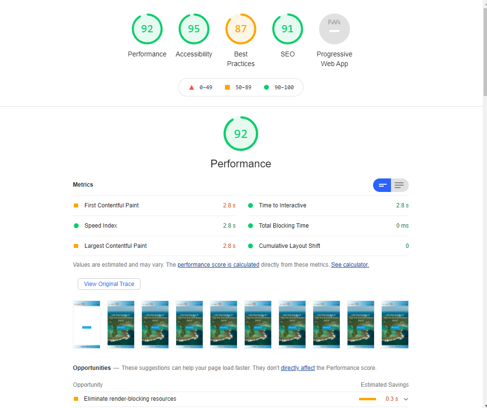

   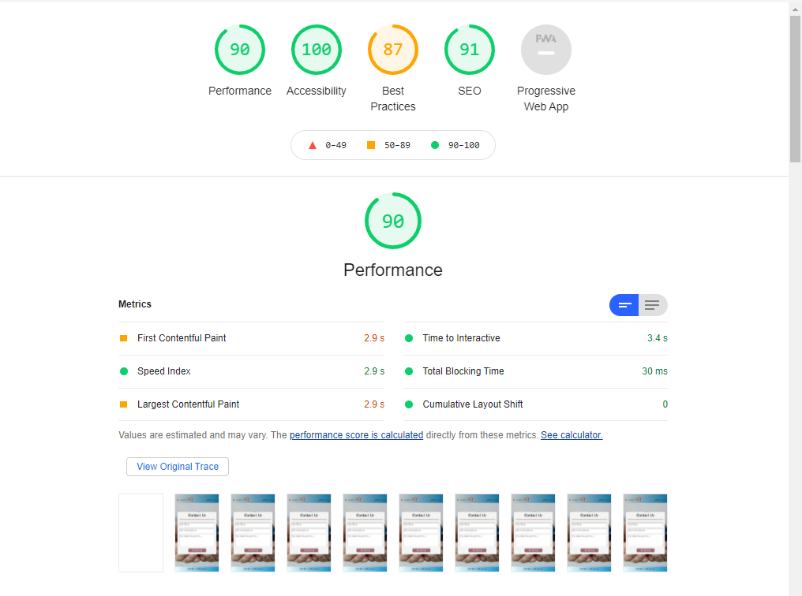

[Back to Highlights ](#highlights)

# Deployment

  The project was deployed on GitHub Pages. I used Gitpod as a work space where I commited all changes to git version control system.
  I used push command in Gitpod to save changes into GitHub. 

 ## To deploy a project: 

   * Log in to GitHub and click on repository to deploy ([Milestone Project 2](https://jas-sin82.github.io/milestone-project-2/)) 

   * Go to the `Settings` and find GitHub Pages section at the very bottom of the page.

   * From source select the `Branch`! and click save and page was deployed after auto-refresh.
.
   * Your site is published at https://jas-sin82.github.io/milestone-project-2/

## To run localy:

   * Log in to GitHub and click on repository to download ([Milestone Project 2]( https://jas-sin82.github.io/milestone-project-2/)).

   * Select `Code` and click Download the ZIP file.

   * After download you can extract the file and use in your local environment.

   * Second option is you can [Clone](https://docs.github.com/en/github/creating-cloning-and-archiving-repositories/cloning-a-repository-from-github/cloning-a-repository)
     or [fork](https://docs.github.com/en/get-started/quickstart/fork-a-repo) this repository ([Milestone Project 2](https://jas-sin82.github.io/milestone-project-2/)) into your github account.
  

[Back to Highlights ](#highlights)

# Credits 

 ## Contents

   80 % of contents of my project is from outside sources:

   *  https://www.earthday.org/the-climate-change-quiz/.

   *  https://cleanet.org/clean/literacy/climate/quiz.html.

 ##   Hints & Ideas 

  *   W3Schools https://www.w3schools.com

  *   JavaScript The Definitive Guide (Author of the book David Flanagan).

  *   https://developer.mozilla.org/en-US/docs/Web/JavaScript 
   

## To finish this project I have used [Code Institute gitpod full template](https://github.com/Code-Institute-Org/gitpod-full-template) 

[Back to Highlights ](#highlights)
 
 
#  Screenshots of complete project 

   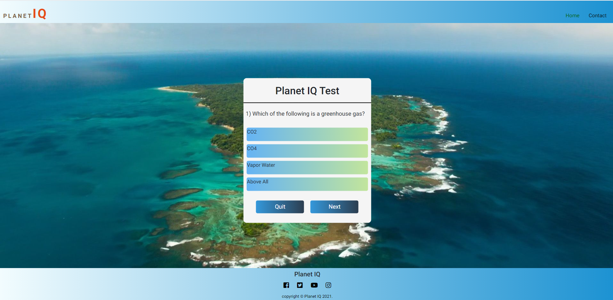

   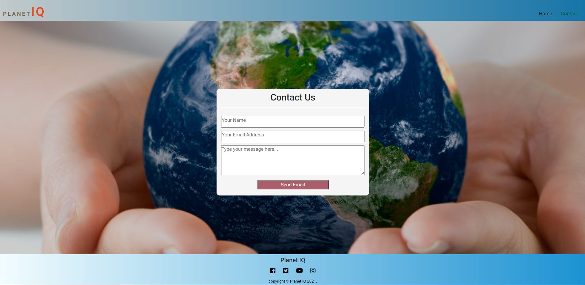

   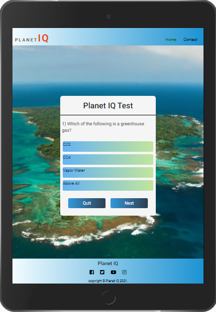

   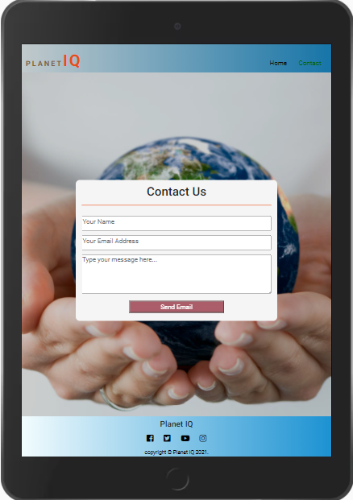

   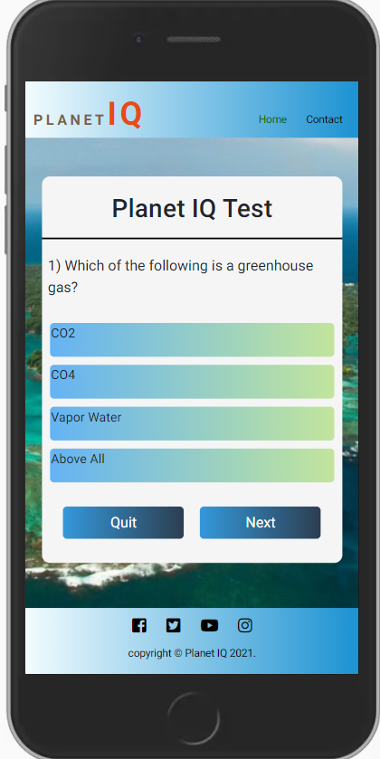

   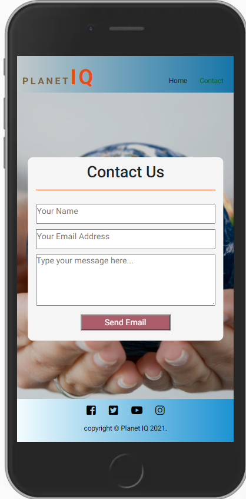

[Back to Highlights ](#highlights)

      
 
  

    

       

